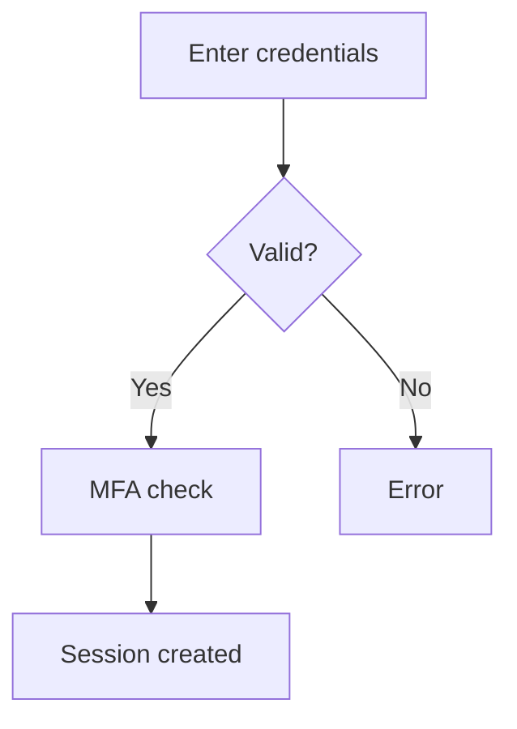

# Mermaid Diagrams

## When to use this skill

Use this skill when the user asks to draw, create, generate, or visualize:
- Flowcharts, sequence diagrams, class diagrams, state diagrams
- Architecture diagrams, system diagrams, ER diagrams
- Gantt charts, timelines, mindmaps, user journeys
- Git branching diagrams, Kanban boards, pie/bar/XY charts
- Sankey diagrams, Wardley maps, Venn diagrams, fishbone/Ishikawa diagrams
- Any diagram or visual representation using Mermaid syntax

For branded PNG/SVG diagram export with charter.json theming, the `diagram` skill handles Excalidraw-based output and accepts Mermaid via its bridge. This skill is the default for inline Markdown diagrams and MCP-rendered previews.

## Workflow

### Mode 1: MCP available (preferred)

When the `mermaid` MCP server is connected, use the preview-iterate-save loop:

1. **Preview** -- render the diagram in the browser with live reload:
   - Call `mermaid_preview` with `diagram`, `preview_id` (kebab-case, descriptive), and optional `theme`/`background`/`width`/`height`/`scale`
   - The browser opens automatically; reusing the same `preview_id` refreshes the same tab
   - Use this as a validation step -- if the diagram renders, the syntax is correct

2. **Iterate** -- refine based on user feedback:
   - Call `mermaid_preview` again with the same `preview_id` and updated `diagram`
   - The browser tab auto-refreshes -- no need to close/reopen

3. **Save** -- export to file when the user wants a file:
   - Call `mermaid_save` with `save_path` and matching `preview_id`
   - Supports `png`, `svg`, `pdf` formats
   - Default save location: `workspace/<client>/output/diagrams/` or user-specified path

### Mode 2: Markdown-only (no MCP)

When the MCP is not available, produce Mermaid syntax in fenced code blocks:

1. Identify the diagram type from the user's request (see type table below)
2. Generate valid Mermaid code in a fenced `mermaid` code block
3. Validate syntax against the pitfall checklist before presenting
4. Only save to a `.md` or `.mmd` file when the user explicitly asks

## Diagram type reference

| Request | Mermaid keyword | Status |
|---------|----------------|--------|
| Flowchart | `flowchart` or `graph` | Stable |
| Sequence diagram | `sequenceDiagram` | Stable |
| Class diagram | `classDiagram` | Stable |
| State diagram | `stateDiagram-v2` | Stable |
| ER diagram | `erDiagram` | Stable |
| User journey | `journey` | Stable |
| Gantt chart | `gantt` | Stable |
| Pie chart | `pie` | Stable |
| Quadrant chart | `quadrantChart` | Stable |
| Requirement diagram | `requirementDiagram` | Stable |
| Git graph | `gitGraph` | Stable |
| C4 diagram | `C4Context` / `C4Container` / `C4Component` / `C4Dynamic` | Stable |
| Mindmap | `mindmap` | Stable |
| Timeline | `timeline` | Stable |
| Sankey diagram | `sankey` | Stable |
| XY chart | `xychart` | Stable |
| Block diagram | `block` | Stable |
| Kanban | `kanban` | Stable |
| Packet diagram | `packet` | Stable |
| Architecture diagram | `architecture-beta` | Beta |
| Wardley map | `wardley-beta` | Beta |
| Venn diagram | `venn` | Beta |
| Ishikawa / fishbone | `ishikawa` | Beta |

Beta types require Mermaid v11.1.0+ (architecture) or v11.13.0+ (Venn, Ishikawa). Warn the user if deploying to environments with older Mermaid versions.

## Syntax validation checklist

Always check before presenting a diagram:

| Rule | Wrong | Right |
|------|-------|-------|
| ER entity names | `LINE-ITEM` | `LINE_ITEM` (underscores only) |
| Flowchart node labels | `end` as label | `End` or `END` (reserved keyword) |
| Class diagram specials | Unescaped `<`, `>` | Backtick-escape: `` `List<String>` `` |
| Gantt dates | `March 1, 2026` | `2026-03-01` (YYYY-MM-DD) |
| Sequence participant alias | `participant A as Auth` (no trailing space) | `participant A as Auth ` -- older parsers need trailing space |
| Sankey data format | Tab-separated with headers | Exactly: `source,target,value` CSV rows after header |
| Mindmap indentation | Mixed tabs/spaces | Consistent indentation (spaces preferred) |

## Styling

### Themes

Five built-in themes: `default`, `dark`, `forest`, `neutral`, `base`.

```
%%{init: {'theme': 'neutral'}}%%
```

**Dark/light mode compatibility**: When deploying to environments that toggle light/dark mode (GitHub, GitLab), do NOT hardcode a theme -- let the platform auto-detect. Hardcoded themes cannot re-render after initialization.

For custom theming, use `themeVariables` with the `base` theme:
```
%%{init: {'theme': 'base', 'themeVariables': {'primaryColor': '#1a73e8', 'primaryTextColor': '#fff'}}}%%
```

### Node and edge styling

- `style nodeId fill:#f9f,stroke:#333` -- inline node style
- `classDef className fill:#f9f,stroke:#333` + `class nodeId className` -- reusable class
- `linkStyle 0 stroke:#ff3,stroke-width:2px` -- edge style by index

**Note**: Sequence diagrams do not support `style` or `classDef` directives.

## Accessibility

Add accessibility metadata to every diagram for screen reader support:



`accTitle` renders as `<title>` and `accDescr` as `<desc>` inside the SVG.

**Not supported in**: mindmap, kanban, sankey (these diagram types parse `accTitle`/`accDescr` as content nodes and will error).

## Complexity management

- **Decompose large diagrams** -- break systems into multiple focused diagrams rather than one monolithic view. LLM-generated diagrams degrade rapidly above ~20 nodes.
- **Use subgraphs** for logical grouping in flowcharts:
  ```
  subgraph Backend
      API --> DB
      API --> Cache
  end
  ```
- **Control spacing** when layouts get cramped:
  ```
  %%{init: {'flowchart': {'nodeSpacing': 50, 'rankSpacing': 50}}}%%
  ```
- **Prefer `flowchart` over `graph`** -- `flowchart` supports Markdown labels, subgraph styling, and multi-directional arrows.

## MCP tool reference

When the `mermaid` MCP is connected:

### `mermaid_preview`

| Parameter | Type | Default | Description |
|-----------|------|---------|-------------|
| `diagram` | string | required | Mermaid diagram code |
| `preview_id` | string | required | Session ID, kebab-case (e.g. `"auth-flow"`) |
| `format` | enum | `"svg"` | `"png"`, `"svg"`, `"pdf"` |
| `theme` | enum | `"default"` | `"default"`, `"forest"`, `"dark"`, `"neutral"` |
| `background` | string | `"white"` | Background color (`"transparent"`, `"#F0F0F0"`) |
| `width` | number | `800` | Width in pixels |
| `height` | number | `600` | Height in pixels |
| `scale` | number | `2` | Scale factor for quality |

### `mermaid_save`

| Parameter | Type | Default | Description |
|-----------|------|---------|-------------|
| `save_path` | string | required | File path (e.g. `"./docs/arch.svg"`) |
| `preview_id` | string | required | Must match a prior `mermaid_preview` call |
| `format` | enum | `"svg"` | `"png"`, `"svg"`, `"pdf"` |

## Output format

- **Inline display** (default): wrap in triple backticks with `mermaid` language tag
- **File export** (when asked or MCP available): use `mermaid_save` for PNG/SVG/PDF
- Never output raw Mermaid code without code block markers
- Use valid Mermaid syntax -- no placeholders, no pseudo-code

## Keywords

mermaid, diagram, chart, graph, flowchart, sequence diagram, class diagram, state diagram, entity relationship, ER diagram, user journey, Gantt chart, pie chart, mindmap, timeline, Sankey, XY chart, block diagram, Kanban, architecture diagram, git graph, C4, Wardley map, Venn diagram, Ishikawa, fishbone, draw, create, generate, visualize, visualization
