# Mermaid Syntax Guide

Detailed syntax examples for each diagram type. Load this reference when generating less common diagram types or when syntax precision is critical.

## Flowchart

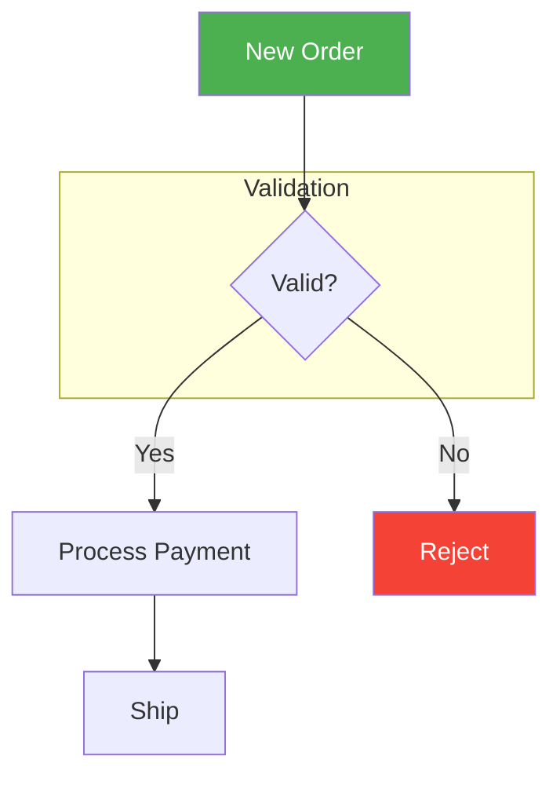
```mermaid
flowchart TD
    accTitle: Order processing flow
    accDescr: Shows order validation through fulfillment
    A[New Order] --> B{Valid?}
    B -->|Yes| C[Process Payment]
    B -->|No| D[Reject]
    C --> E[Ship]

    subgraph Validation
        B
    end

    style A fill:#4CAF50,color:#fff
    classDef error fill:#f44336,color:#fff
    class D error
```

Direction options: `TD` (top-down), `LR` (left-right), `BT` (bottom-top), `RL` (right-left).

Node shapes:
- `[text]` -- rectangle
- `(text)` -- rounded
- `{text}` -- diamond (decision)
- `[[text]]` -- subroutine
- `[(text)]` -- cylinder (database)
- `((text))` -- circle
- `>text]` -- asymmetric
- `{{text}}` -- hexagon

## Sequence Diagram

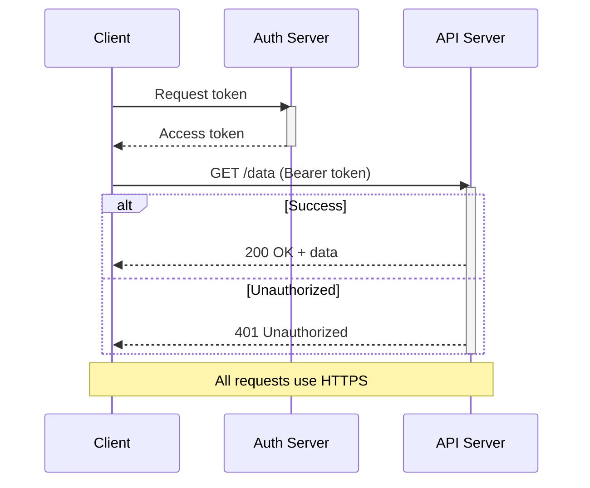
```mermaid
sequenceDiagram
    accTitle: API authentication sequence
    accDescr: Client authenticates via OAuth then calls API
    participant C as Client
    participant A as Auth Server
    participant API as API Server

    C->>A: Request token
    activate A
    A-->>C: Access token
    deactivate A
    C->>API: GET /data (Bearer token)
    activate API
    alt Success
        API-->>C: 200 OK + data
    else Unauthorized
        API-->>C: 401 Unauthorized
    end
    deactivate API

    Note over C,API: All requests use HTTPS
```

Arrow types:
- `->` solid line without arrow
- `-->` dotted line without arrow
- `->>` solid line with arrow
- `-->>` dotted line with arrow
- `-x` solid line with cross
- `--x` dotted line with cross

**Note**: `style` and `classDef` directives are NOT supported in sequence diagrams.

## Class Diagram

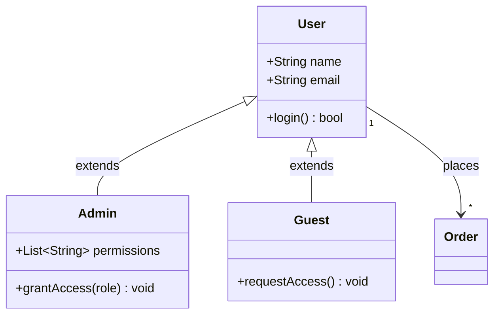
```mermaid
classDiagram
    accTitle: User model hierarchy
    accDescr: Shows User base class with Admin and Guest specializations
    class User {
        +String name
        +String email
        +login() bool
    }
    class Admin {
        +List~String~ permissions
        +grantAccess(role) void
    }
    class Guest {
        +requestAccess() void
    }
    User <|-- Admin : extends
    User <|-- Guest : extends
    User "1" --> "*" Order : places
```

Use `~` instead of `<>` for generics: `List~String~` not `List<String>`.

Relationship types:
- `<|--` inheritance
- `*--` composition
- `o--` aggregation
- `-->` association
- `..>` dependency
- `..|>` realization

## State Diagram

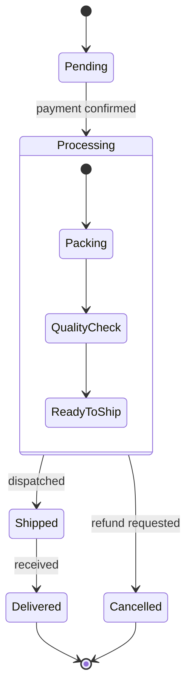
```mermaid
stateDiagram-v2
    accTitle: Order lifecycle
    accDescr: States from creation through completion or cancellation
    [*] --> Pending
    Pending --> Processing : payment confirmed
    Processing --> Shipped : dispatched
    Shipped --> Delivered : received
    Processing --> Cancelled : refund requested
    Delivered --> [*]
    Cancelled --> [*]

    state Processing {
        [*] --> Packing
        Packing --> QualityCheck
        QualityCheck --> ReadyToShip
    }
```

Always use `stateDiagram-v2` (not `stateDiagram`).

## ER Diagram

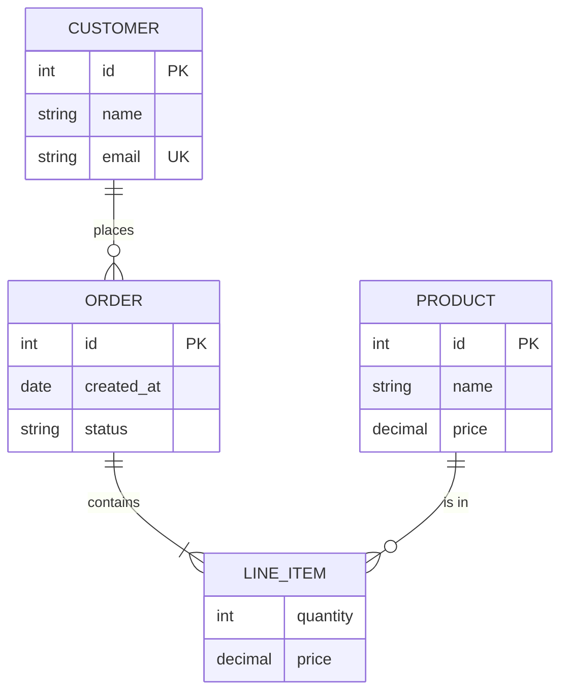
```mermaid
erDiagram
    accTitle: E-commerce data model
    accDescr: Core entities for order management
    CUSTOMER ||--o{ ORDER : places
    ORDER ||--|{ LINE_ITEM : contains
    PRODUCT ||--o{ LINE_ITEM : "is in"

    CUSTOMER {
        int id PK
        string name
        string email UK
    }
    ORDER {
        int id PK
        date created_at
        string status
    }
    LINE_ITEM {
        int quantity
        decimal price
    }
    PRODUCT {
        int id PK
        string name
        decimal price
    }
```

**Critical**: Entity names must use underscores, never hyphens.

Cardinality: `||` exactly one, `o|` zero or one, `}|` one or more, `}o` zero or more.

## Gantt Chart

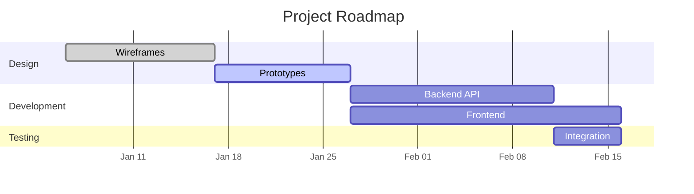
```mermaid
gantt
    accTitle: Project timeline
    accDescr: Q1 development milestones
    title Project Roadmap
    dateFormat YYYY-MM-DD
    axisFormat %b %d

    section Design
        Wireframes      :done, d1, 2026-01-06, 2026-01-17
        Prototypes      :active, d2, after d1, 10d
    section Development
        Backend API     :d3, after d2, 15d
        Frontend        :d4, after d2, 20d
    section Testing
        Integration     :d5, after d3, 5d
```

## Mindmap

**Note**: Mindmap does not support `accTitle`/`accDescr` -- the parser treats them as content nodes.

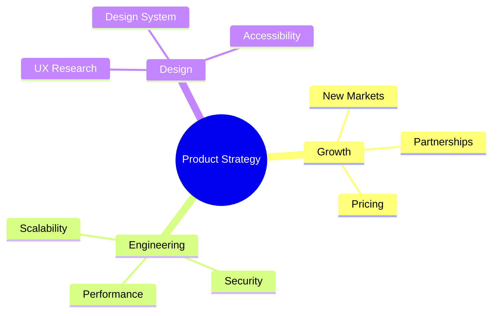
```mermaid
mindmap
    root((Product Strategy))
        Growth
            New Markets
            Partnerships
            Pricing
        Engineering
            Performance
            Security
            Scalability
        Design
            UX Research
            Design System
            Accessibility
```

Indentation defines hierarchy. Use consistent spaces (not tabs).

## Timeline

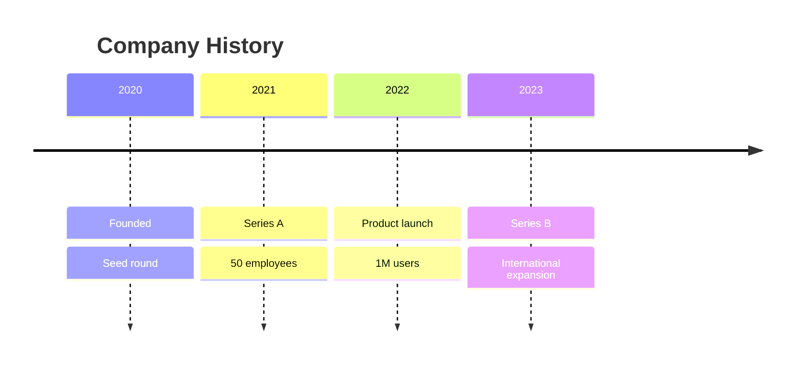
```mermaid
timeline
    accTitle: Company milestones
    accDescr: Key events from founding through IPO
    title Company History
    2020 : Founded
         : Seed round
    2021 : Series A
         : 50 employees
    2022 : Product launch
         : 1M users
    2023 : Series B
         : International expansion
```

## Sankey

**Note**: Sankey does not support `accTitle`/`accDescr`.

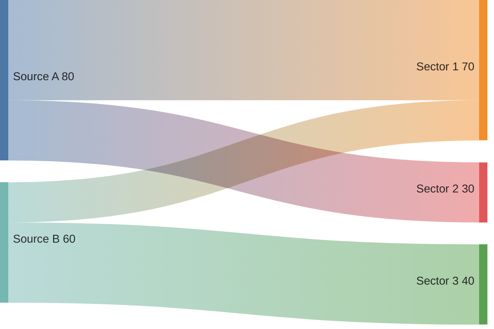
```mermaid
sankey
    Source A,Sector 1,50
    Source A,Sector 2,30
    Source B,Sector 1,20
    Source B,Sector 3,40
```

Format: CSV rows with `source,target,value`. No spaces after commas in data rows.

## XY Chart

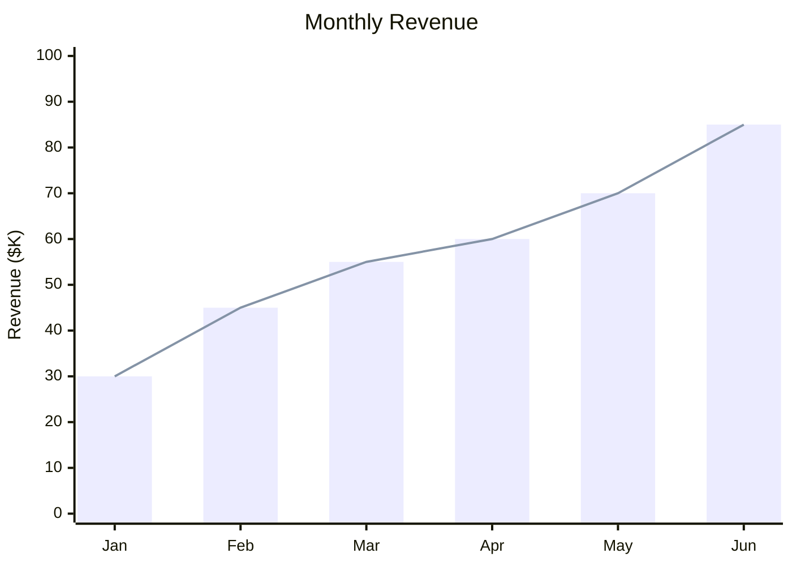
```mermaid
xychart
    accTitle: Monthly revenue
    accDescr: Revenue growth over 6 months
    title "Monthly Revenue"
    x-axis ["Jan", "Feb", "Mar", "Apr", "May", "Jun"]
    y-axis "Revenue ($K)" 0 --> 100
    bar [30, 45, 55, 60, 70, 85]
    line [30, 45, 55, 60, 70, 85]
```

## Kanban

**Note**: Kanban does not support `accTitle`/`accDescr`.

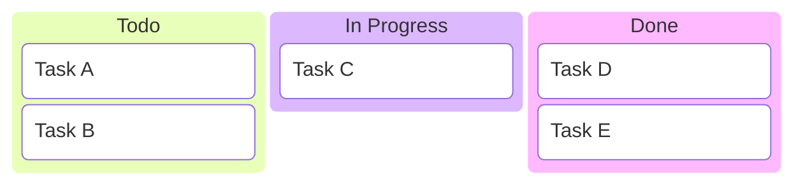
```mermaid
kanban
    Todo
        Task A
        Task B
    In Progress
        Task C
    Done
        Task D
        Task E
```

## Git Graph

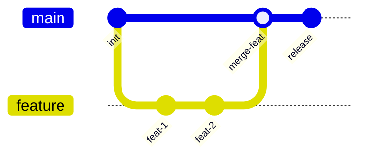
```mermaid
gitGraph
    accTitle: Feature branch workflow
    accDescr: Shows feature branch merge strategy
    commit id: "init"
    branch feature
    checkout feature
    commit id: "feat-1"
    commit id: "feat-2"
    checkout main
    merge feature id: "merge-feat"
    commit id: "release"
```

## C4 Context

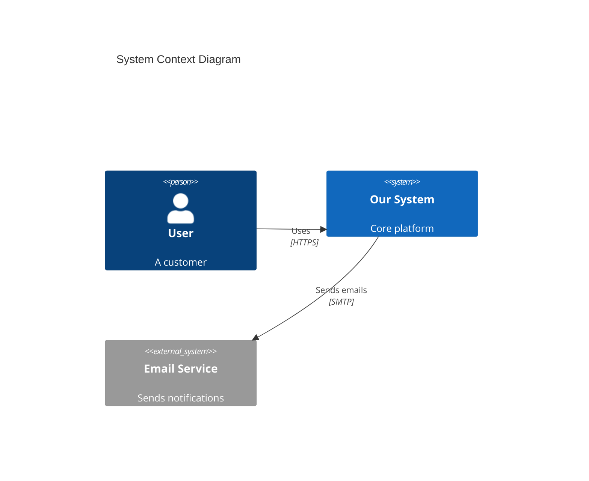
```mermaid
C4Context
    accTitle: System context
    accDescr: How the system interacts with users and external services
    title System Context Diagram

    Person(user, "User", "A customer")
    System(sys, "Our System", "Core platform")
    System_Ext(email, "Email Service", "Sends notifications")

    Rel(user, sys, "Uses", "HTTPS")
    Rel(sys, email, "Sends emails", "SMTP")
```

## Architecture (beta)

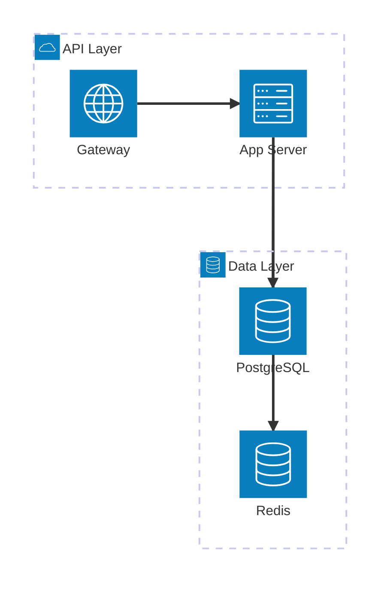
```mermaid
architecture-beta
    group api(cloud)[API Layer]
    group db(database)[Data Layer]

    service gateway(internet)[Gateway] in api
    service app(server)[App Server] in api
    service postgres(database)[PostgreSQL] in db
    service redis(database)[Redis] in db

    gateway:R --> L:app
    app:B --> T:postgres
    app:B --> T:redis
```

Requires Mermaid v11.1.0+. Uses directional ports: `T` (top), `B` (bottom), `L` (left), `R` (right).

## Pie Chart

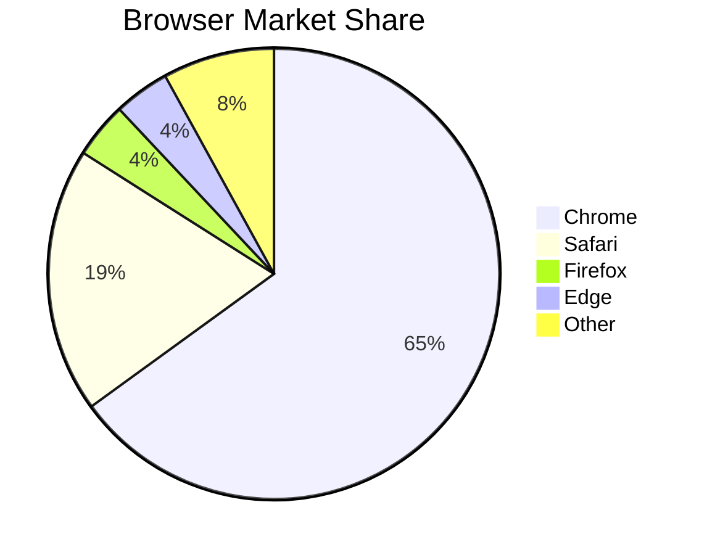
```mermaid
pie
    accTitle: Market share
    accDescr: Browser market share distribution
    title Browser Market Share
    "Chrome" : 65
    "Safari" : 19
    "Firefox" : 4
    "Edge" : 4
    "Other" : 8
```

## Quadrant Chart

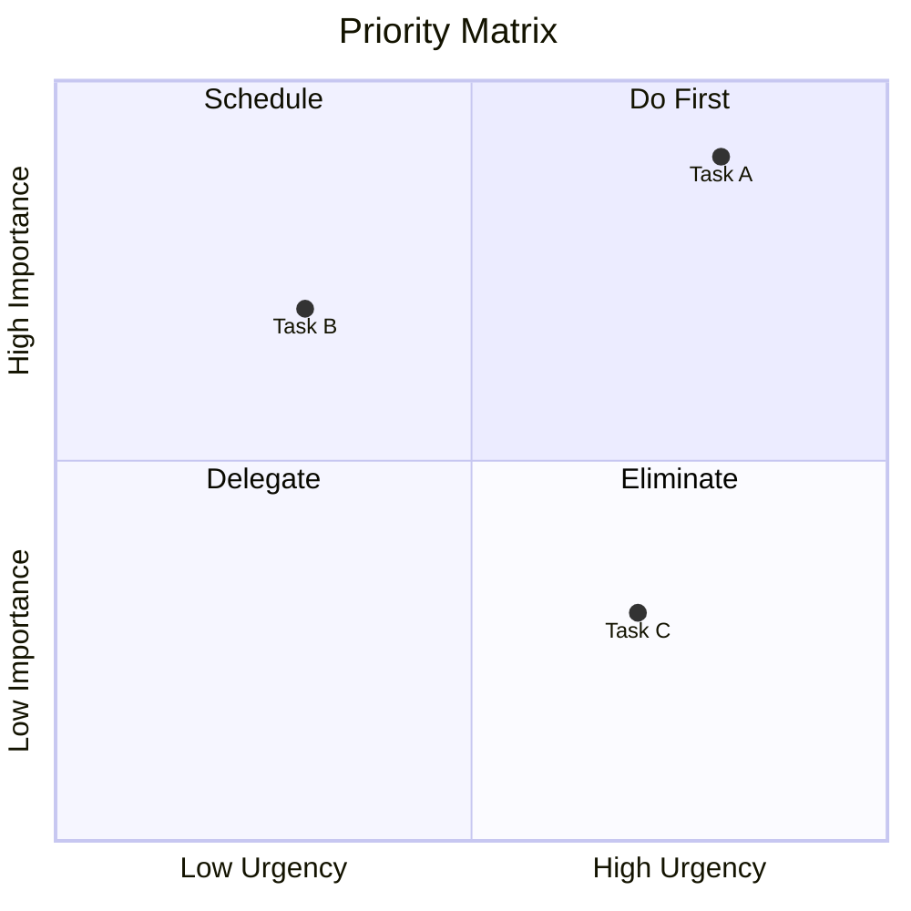
```mermaid
quadrantChart
    accTitle: Priority matrix
    accDescr: Tasks plotted by urgency and importance
    title Priority Matrix
    x-axis Low Urgency --> High Urgency
    y-axis Low Importance --> High Importance
    quadrant-1 Do First
    quadrant-2 Schedule
    quadrant-3 Delegate
    quadrant-4 Eliminate
    Task A: [0.8, 0.9]
    Task B: [0.3, 0.7]
    Task C: [0.7, 0.3]
```

## Ishikawa / Fishbone (beta, v11.13.0+)

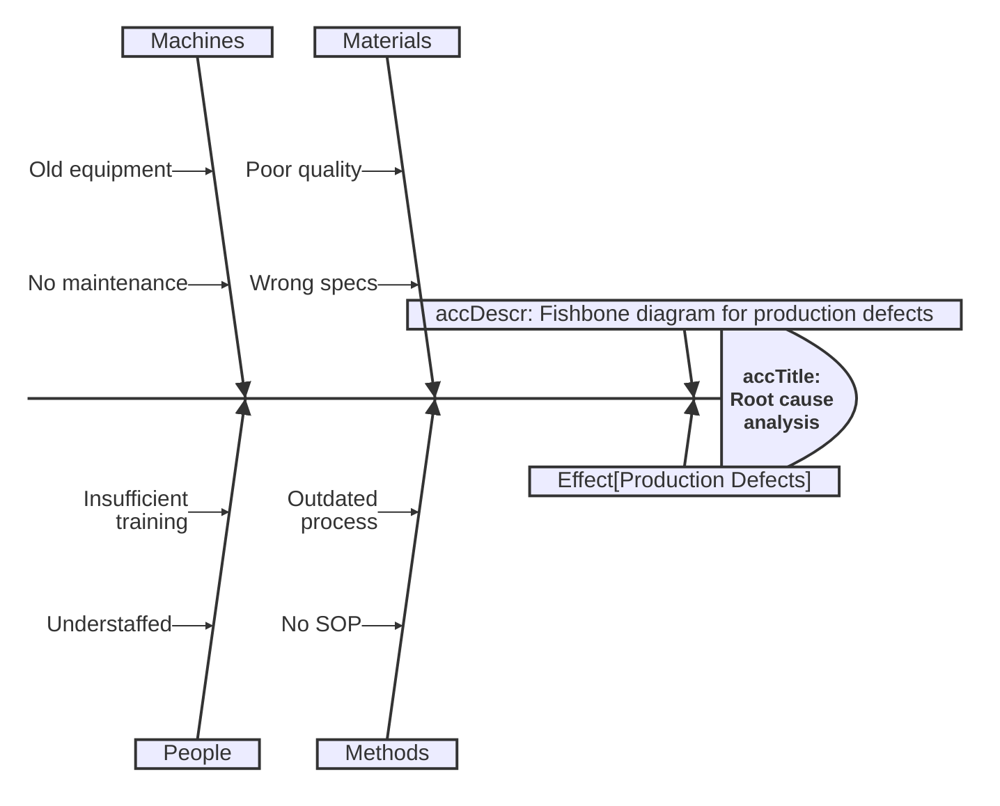
```mermaid
ishikawa
    accTitle: Root cause analysis
    accDescr: Fishbone diagram for production defects
    Effect[Production Defects]
    Materials
        Poor quality
        Wrong specs
    Methods
        Outdated process
        No SOP
    Machines
        Old equipment
        No maintenance
    People
        Insufficient training
        Understaffed
```

## Venn Diagram (beta, v11.13.0+)

```mermaid
venn
    accTitle: Skill overlap
    accDescr: Intersection of design, engineering, and product skills
    Set A: "Design"
    Set B: "Engineering"
    Set C: "Product"
    Intersection AB: "UX Engineering"
    Intersection BC: "Technical PM"
    Intersection AC: "Design Thinking"
    Intersection ABC: "Full Stack Product"
```
